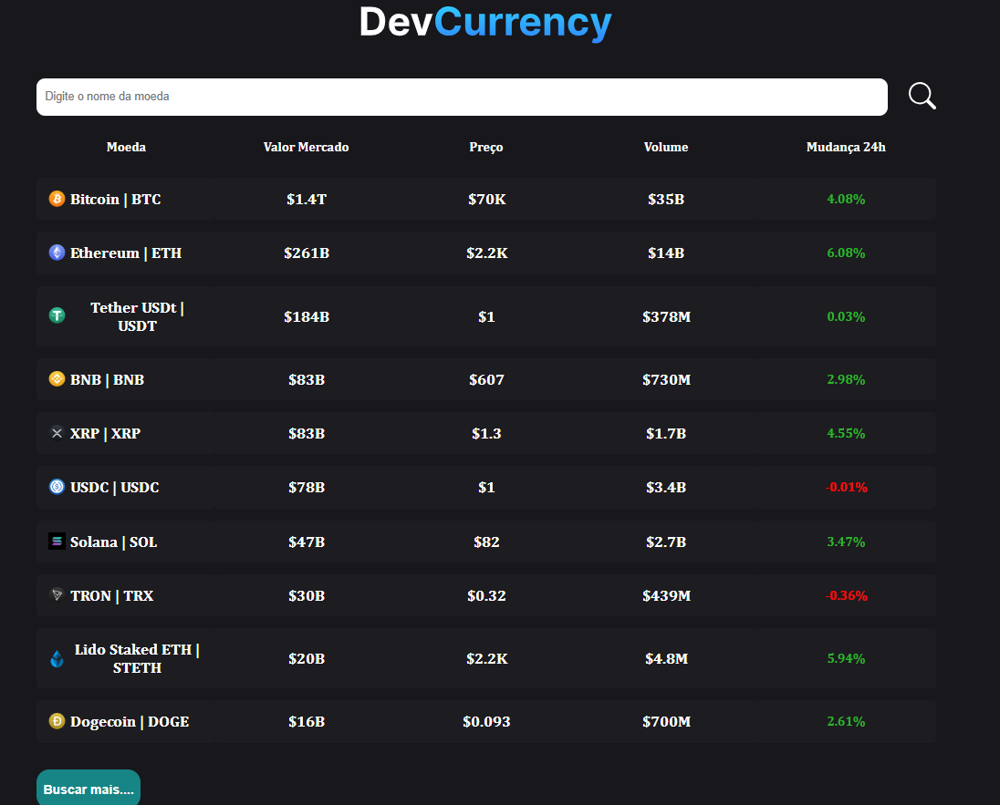

# 💰 DevCurrency

### Acompanhe o mercado de criptomoedas em tempo real!


DevCurrency é uma aplicação web moderna que permite acompanhar criptomoedas com dados atualizados em **tempo real** via API da [CoinCap](https://docs.coincap.io/). Desenvolvida com foco em performance, tipagem segura e uma experiência de usuário fluida.

## 📸 Demonstração

<div align="center">
  
  <br>
  <em>Tela principal da aplicação com listagem de criptomoedas</em>
</div>

## 🚀 Funcionalidades

| Funcionalidade | Descrição |
|----------------|-----------|
| 📋 **Listagem completa** | Exibe as principais criptomoedas com preço, capitalização de mercado, volume e variação em 24h |
| 🔍 **Busca inteligente** | Aceita maiúsculas, minúsculas ou qualquer formato (ex: "Bitcoin", "BITCOIN", "bitcoin") |
| 📄 **Página de detalhes** | Informações completas da moeda com link oficial |
| ✅ **Validação de moeda** | Verifica se a criptomoeda existe antes de navegar, com mensagem amigável |
| ⏳ **Feedback visual** | Indicadores de loading durante requisições e mensagens de erro claras |
| 📱 **Design responsivo** | Funciona perfeitamente em dispositivos móveis, tablets e desktops |
| 🧹 **Limpeza automática** | Input é limpo automaticamente caso a moeda não seja encontrada |
| 🧭 **Página 404** | Rota personalizada para páginas não encontradas |

## 📊 Dados exibidos na tabela

Conforme a imagem de demonstração, a aplicação exibe para cada criptomoeda:

| Coluna | Descrição |
|--------|-----------|
| 🪙 **Moeda** | Nome e símbolo (ex: Bitcoin \| BTC) |
| 💰 **Valor Mercado** | Capitalização total de mercado |
| 💵 **Preço** | Preço atual em USD |
| 📈 **Volume** | Volume negociado em 24h |
| 📉 **Mudança 24h** | Variação percentual nas últimas 24 horas (verde para positivo, vermelho para negativo) |

## 🛠️ Tecnologias utilizadas

| Tecnologia | Finalidade |
|------------|-------------|
| React | Interface de usuário |
| TypeScript | Tipagem estática e segurança no código |
| React Router DOM | Navegação entre páginas |
| CSS Modules | Estilização organizada e escopada |
| CoinCap API | Dados atualizados de criptomoedas |
| Vite | Build rápida e ambiente de desenvolvimento |

## 📦 Como executar o projeto

### Pré-requisitos

- Node.js (versão 18 ou superior)
- npm ou yarn

### Passo a passo

```bash
# Clone o repositório
git clone https://github.com/Gabriell-Santos/DevCurrency.git

# Acesse a pasta do projeto
cd DevCurrency

# Instale as dependências
npm install

# Execute o projeto em modo desenvolvimento
npm run dev
